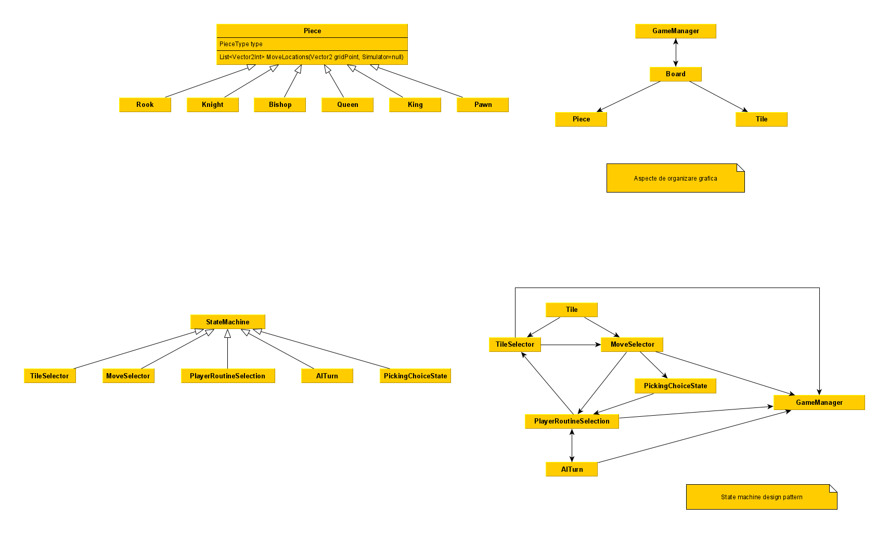
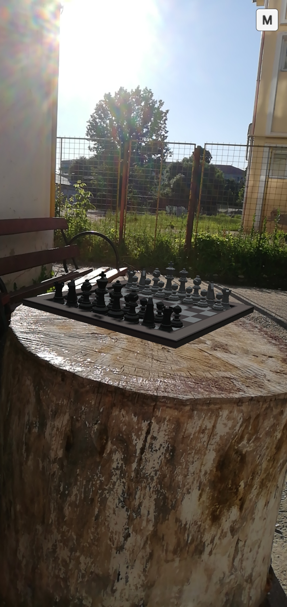

# ChessAR
 ## Despre ce e vorba in acest joc
 #### ChessAR e un joc e realitate augmentata implementat in Unity. El permite utilizatorilor Android sa joace sah, impotriva utilizand o metoda a inteligentei artificiale.
 ## Demo
 
 ## Diagrama
 
 ## Permisiuni
 ### Trebuie sa permiti acces la camera foto.
 ## Caracteristici
 * ecran care se roteste
 * rapiditate care depinde de utilizator
 *  meniu reia, restart, inchide 
 * iti arata o posibila miscare
 * jucatorului nu ii este permis sa faca miscari invalide
 * Tabla si piese de joc 3D
 ## Cum sa joci
 * pozitioneaza camera pe o suprafata plata, cu o lumina, textura si culoare buna
 * faci pauza daca apesi stanga
 * meniu de reia, restart , inchide
 * are un meniu de unde poti muta
 * poti muta direct daca atingi piesele de joc
## Regulile jocului
#### Are aceleasi reguli ca obisnuitul joc de sah.
#### Daca nu stii sa joci sah, poti arunca o privire [aici](https://www.chess.com/learn-how-to-play-chess)
## Plan de testare
#### Tetare manuala. Fiecare caracteristica a fot testata pe editorul Unity dupa implementare, de asemenea de pe multe dispozitive android, folosind un build de dezvoltare.
## Prezentare generala

